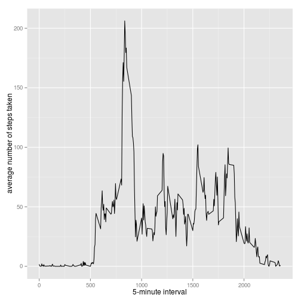

## Loading and preprocessing the data

```r
unzip(zipfile="activity.zip")
data <- read.csv("activity.csv")
```

## What is mean total number of steps taken per day?
Total steps per day:

```r
library(ggplot2)
steps <- tapply(data$steps, data$date, FUN=sum, na.rm=TRUE)
qplot(steps, binwidth=1000, xlab="Total number of steps by day")
```

 
Mean of steps taken per day:

```r
mean(steps, na.rm=TRUE)
```

```
## [1] 9354.23
```
Median of steps taken per day:

```r
median(steps, na.rm=TRUE)
```

```
## [1] 10395
```

## What is the average daily activity pattern?

```r
avgs <- aggregate(x=list(steps=data$steps), by=list(interval=data$interval), FUN=mean, na.rm=TRUE)
ggplot(data=avgs, aes(x=interval, y=steps)) +
    geom_line() +
    xlab("5-minute interval") +
    ylab("average number of steps taken")
```

 
The maximum number of steps is:

```r
avgs[which.max(avgs$steps),]
```

```
##     interval    steps
## 104      835 206.1698
```

## Imputing missing values

```r
missing <- is.na(data$steps)
```
Number of missing values:

```r
table(missing)
```

```
## missing
## FALSE  TRUE 
## 15264  2304
```
Filling missing values by the mean value of its 5-minute interval:

```r
filler <- function(steps, interval) {
    filled <- NA
    if (!is.na(steps))
        filled <- c(steps)
    else
        filled <- (avgs[avgs$interval==interval, "steps"])
    return(filled)
}

datafilled <- data
datafilled$steps <- mapply(filler, datafilled$steps, datafilled$interval)
```
Making histogram:

```r
steps <- tapply(datafilled$steps, datafilled$date, FUN=sum)
qplot(steps, binwidth=1000, xlab="total number of steps taken each day")
```

 
Mean and the median of imputed data:

```r
mean(steps)
```

```
## [1] 10766.19
```

```r
median(steps)
```

```
## [1] 10766.19
```

## Are there differences in activity patterns between weekdays and weekends?
Creating a new factor variable:

```r
WoW <- function(date) {
    day <- weekdays(date)
    if (day %in% c("Monday", "Tuesday", "Wednesday", "Thursday", "Friday"))
        return("weekday")
    else if (day %in% c("Saturday", "Sunday"))
        return("weekend")
    else
        stop("invalid date")
}
datafilled$date <- as.Date(datafilled$date)
datafilled$day <- sapply(datafilled$date, FUN=WoW)
```
Panel plot containing a time series plot of the 5-minute interval and the average number of steps taken, averaged across all weekday days or weekend days:

```r
avgs <- aggregate(steps ~ interval + day, data=datafilled, mean)
```

```
## Error in get(as.character(FUN), mode = "function", envir = envir): object 'FUN' of mode 'function' was not found
```

```r
ggplot(avgs, aes(interval, steps)) + geom_line() + facet_grid(day ~ .) +
    xlab("5-minute interval") + ylab("Number of steps")
```

```
## Error in layout_base(data, rows, drop = drop): At least one layer must contain all variables used for facetting
```
